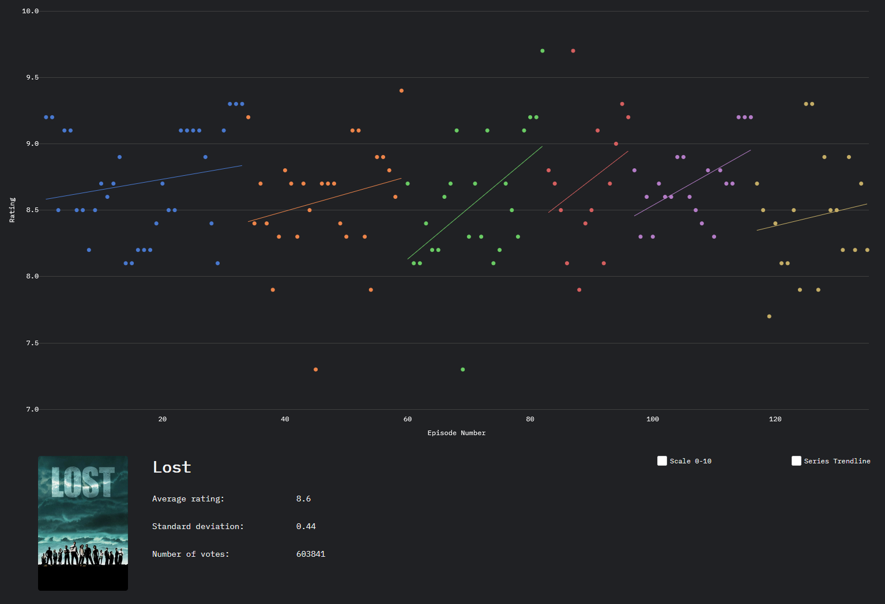

# TVTrend
Plot episode user ratings for TV shows.

Show searching is provided through the [Trakt.tv API](https://trakt.docs.apiary.io/). Episode rating data is scraped from either [IMDb](http://imdb.com) or [Trakt.tv](http://trakt.tv).

## Config

Config variables are required in a `config.py` file in the root directory, containing:

Variable | Description
--- | ---
`TRAKT_API` | Trakt.tv API key
`SECRET_KEY` | flask secret key